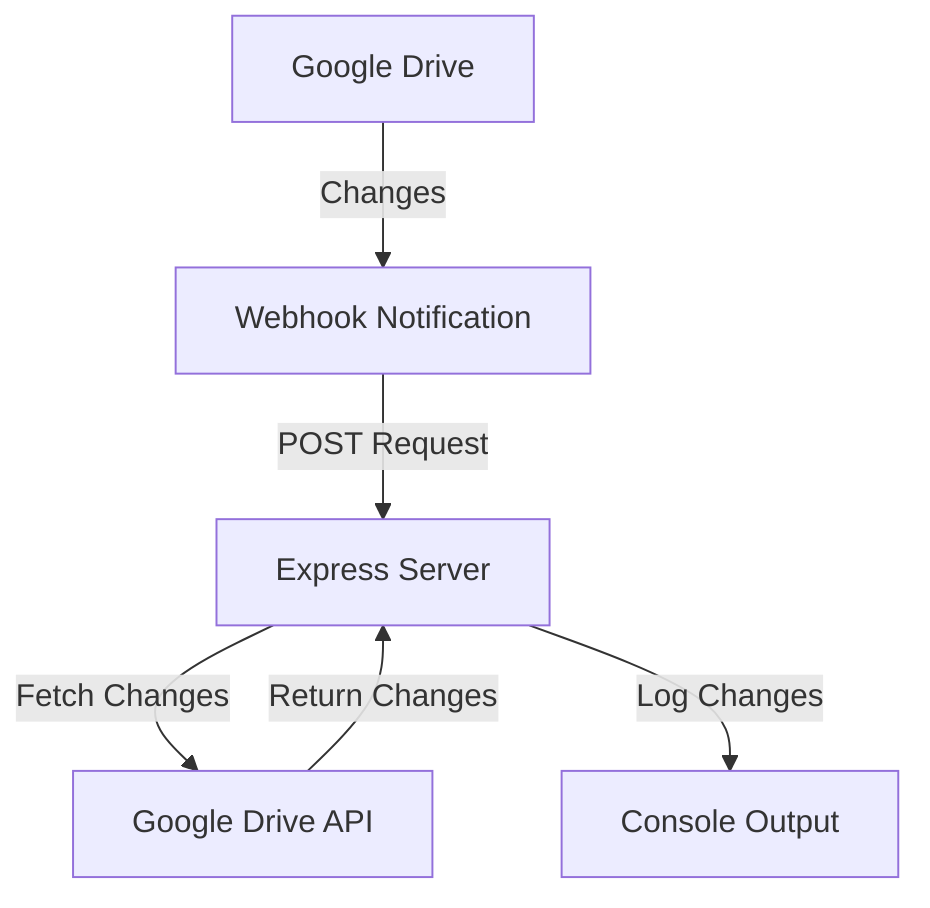
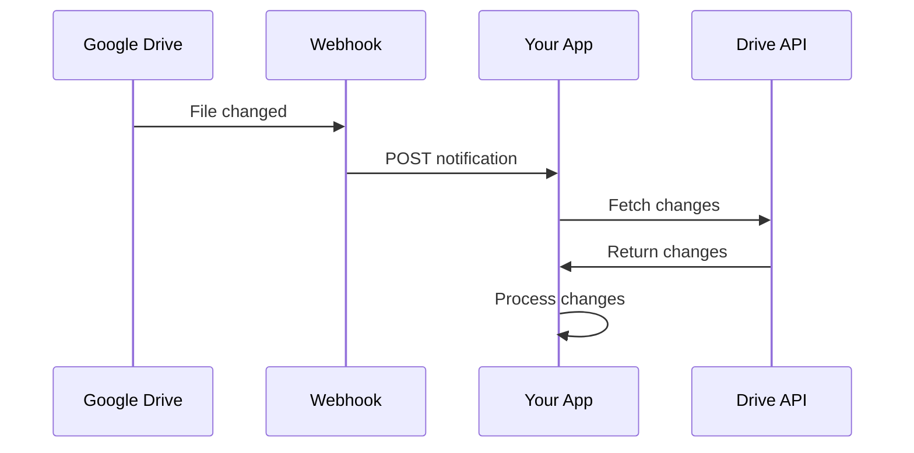

# Google Drive Changes Monitor

<div align="center">
  
  
  
  
</div>

<p align="center">
  <b>A Node.js application that monitors changes to your Google Drive and receives notifications via webhooks.</b>
</p>

<div align="center">
  
  
  
</div>

## 📋 Overview

This application uses the Google Drive API to watch for changes in your Google Drive and receives notifications through a webhook. It's designed to track file modifications, creations, and deletions in real-time.



## ✨ Features

- 🔄 Real-time monitoring of Google Drive changes
- 🔔 Webhook notifications for file events
- 📝 Detailed logging of file changes
- 🔗 Support for all drive types (including shared drives)

## 🛠️ Prerequisites

- [Node.js](https://nodejs.org/) (v18 or higher)
- [Google Cloud Platform](https://cloud.google.com/) account with Drive API enabled
- OAuth2 credentials (Client ID and Client Secret)
- [ngrok](https://ngrok.com/) for exposing your local server to the internet

## 📥 Installation

1. Clone this repository:

   ```bash
   git clone <repository-url>
   cd drive-changes
   ```

2. Install dependencies:

   ```bash
   npm install
   ```

3. Create a `.env` file in the root directory with the following variables:

   ```env
   # Google OAuth2 Credentials
   ACCESS_TOKEN=your_access_token
   CLIENT_ID=your_client_id
   CLIENT_SECRET=your_client_secret
   REDIRECT_URI=your_redirect_uri

   # Ngrok or Public Webhook URL
   NGROK_WEBHOOK=your_webhook_url
   ```

## 🔌 Ngrok Setup

1. Install ngrok:

   - Windows (using Chocolatey): `choco install ngrok`
   - macOS (using Homebrew): `brew install ngrok`
   - Linux: Download from [ngrok website](https://ngrok.com/download)

2. Sign up for a free ngrok account at [ngrok.com](https://ngrok.com)

3. Get your authtoken from the ngrok dashboard and configure it:

   ```bash
   ngrok config add-authtoken your_ngrok_auth_token
   ```

4. Start ngrok to expose your local server:

   ```bash
   ngrok http 3000
   ```

5. Copy the HTTPS URL provided by ngrok (e.g., `https://abc123.ngrok.io`)

6. Update your `.env` file with the ngrok URL:
   ```env
   NGROK_WEBHOOK=https://abc123.ngrok.io
   ```

> **Note**: The ngrok URL changes each time you restart ngrok unless you have a paid account. You'll need to update your `.env` file and restart the application when this happens.

## 🚀 Usage

1. Start the application:

   ```bash
   npm start
   ```

2. The application will:

   - Initialize the Google Drive client
   - Set up a webhook to receive notifications
   - Log the channel ID and expiration time
   - Begin monitoring for changes

3. When changes occur in your Google Drive, the application will:
   - Receive a notification via the webhook
   - Fetch the latest changes using the Drive API
   - Log details about the changed files

## 📁 Project Structure

```
drive-changes/
├── .env                  # Environment variables
├── .vscode/              # VS Code configuration
├── drive/                # Drive-related utilities
│   └── driveUtils.js     # Google Drive API utilities
├── node_modules/         # Dependencies
├── index.js              # Main application entry point
├── package.json          # Project metadata and dependencies
└── README.md             # This file
```

## 📦 Dependencies

| Package                                                  | Version  | Purpose                         |
| -------------------------------------------------------- | -------- | ------------------------------- |
| [express](https://www.npmjs.com/package/express)         | ^4.18.2  | Web server framework            |
| [body-parser](https://www.npmjs.com/package/body-parser) | ^1.20.2  | Request body parsing middleware |
| [dotenv](https://www.npmjs.com/package/dotenv)           | ^16.3.1  | Environment variable management |
| [googleapis](https://www.npmjs.com/package/googleapis)   | ^132.0.0 | Google API client library       |
| [uuid](https://www.npmjs.com/package/uuid)               | ^9.0.0   | UUID generation for channel IDs |

## 🔗 Webhook Setup

The application uses Google Drive's push notifications feature, which requires a publicly accessible webhook URL. You can use a service like [ngrok](https://ngrok.com/) to expose your local server to the internet.



## 📝 License

[MIT](LICENSE)

## 🤝 Contributing

Contributions are welcome! Please feel free to submit a Pull Request.

1. Fork the repository
2. Create your feature branch (`git checkout -b feature/amazing-feature`)
3. Commit your changes (`git commit -m 'Add some amazing feature'`)
4. Push to the branch (`git push origin feature/amazing-feature`)
5. Open a Pull Request

## 📞 Support

If you encounter any issues or have questions, please [open an issue](https://github.com/yourusername/drive-changes/issues) on GitHub.

---

<div align="center">
  <sub>Built with ❤️ by <a href="https://github.com/yourusername">Your Name</a></sub>
</div>
